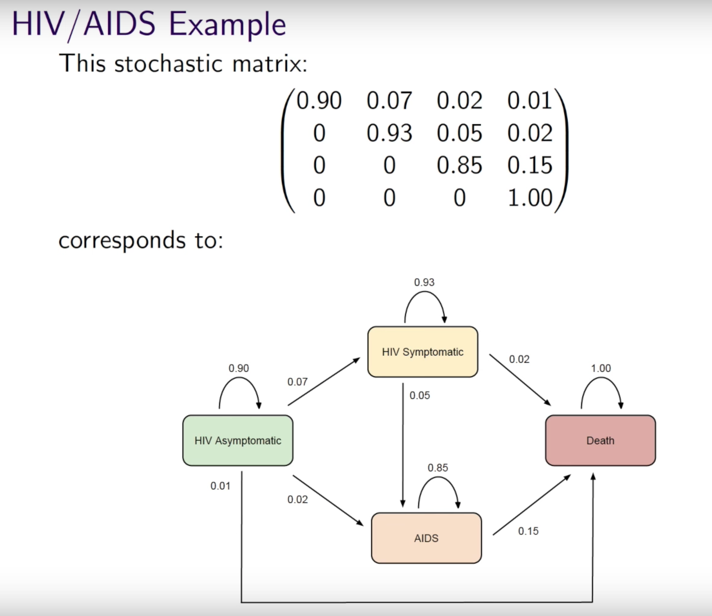

# Artificial Intelligence

# Bellman Equation

# Discrete Markov Chain

Definition. Given a finite set of states \( \Omega = \{ X_0, \ldots, X_N \}, \) a discrete Markov chain is a stochastic process that satisfies

\[
P \left( X _ { n + 1 } = x _ { n + 1 } | X _ { n } = x _ { n } , \ldots , X _ { 0 } = x _ { 0 } \right) = P \left( X _ { n + 1 } = x _ { n + 1 } | X _ { n } = x _ { n } \right),
\]

i.e. the present is enough to determine the future.

Question. Are we working with finitely many states? [It's always finite in the real world.]

Notation: the probability of moving from state i to state j at time n is written

\[
p _ { i j } ( n ) = P \left( X _ { n + 1 } = j | X _ { n } = i \right).
\]

Definition. Transition matrix:

\[
P ( n ) = \left( \begin{array} { c c c c c } { p _ { 00 } ( n ) } & { p _ { 01 } ( n ) } & { p _ { 02 } ( n ) } & { \dots } & { p _ { 0 j } ( n ) } & { \dots } \\ { p _ { 10 } ( n ) } & { p _ { 11 } ( n ) } & { p _ { 12 } ( n ) } & { \dots } & { p _ { 1 j } ( n ) } & { \dots } \\ { p _ { 20 } ( n ) } & { p _ { 21 } ( n ) } & { p _ { 22 } ( n ) } & { \dots } & { p _ { 2 j } ( n ) } & { \dots } \\ { \vdots } & { \vdots } & { \vdots } & { \vdots } & { \vdots } & { \vdots } \\ { p _ { i 0 } ( n ) } & { p _ { i 1 } ( n ) } & { p _ { i 2 } ( n ) } & { \dots } & { p _ { i j } ( n ) } & { \dots } \\ { \vdots } & { \vdots } & { \vdots } & { \vdots } & { \vdots } & { \vdots } \end{array} \right).
\]

Properties:

- \( P(n) \) is a square matrix.
- \( \sum_{j} p_{ij} (n) = 1 \) for all \( j \in \Omega. \) Row \( i \) gives the probabilities of moving from state \( i \) to all states, so they should all add up to \( 1. \)
- \( p_{ij}(n) \geq 0. \)

# Markov Decision Process

Definition. _A Markov Decision Process is a tuple \( (S, A, P, R, \gamma), \) where S is a finite set of states, A is a finite set of actions, P is a state transition probability matrix, R is a reward function, and \( \gamma \) is a discount factor._

# Reward signal vs value function

Reward is short-term, value is long-term. Ultimately we want to make decisions based on long-term value judgement.

# Temporal difference update

\[
V(s) = V(s) + \alpha (V(s') - V(s)).
\]

# Law of Effect

Of several responses made to the same situation,  those which are accompanied or
closely followed by satisfaction to the animal will, other things being equal,
be more firmly connected with the situation, so that, when it recurs, they will
be more likely to recur; those which are accompanied or closely followed by
discomfort to the animal will, other things being equal, have their connections
with that situation weakened, so that, when it recurs, they will be less likely
to occur.  The greater the satisfaction or discomfort, the greater the
strengthening or weakening of the bond.  (Thorndike, 1911, p. 244)

## Policy Function

Definition. _A policy \( \pi \) is a distribution over actions given states._

\[
\pi(a|S) = P[A_t = a | S_t = s].
\]

I.e. Given the current state, what is the most likely action to take. A policy fully defines the behavior of an agent.
